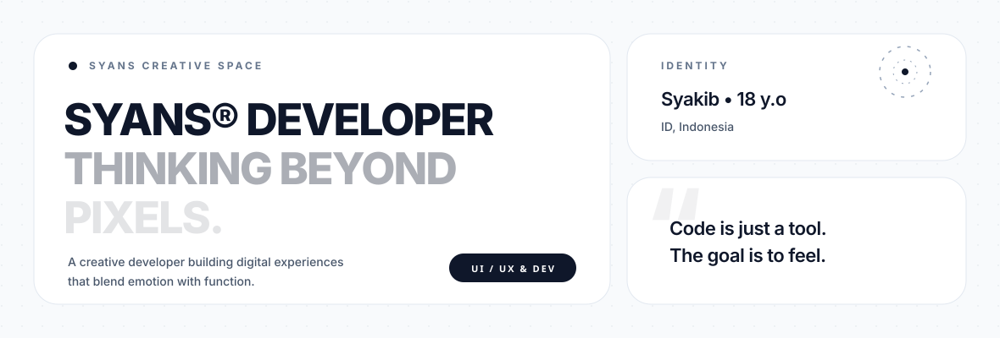
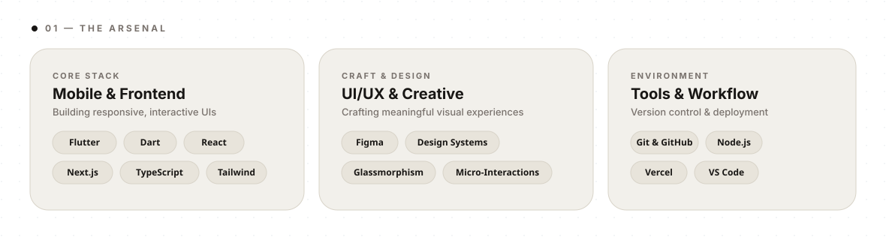
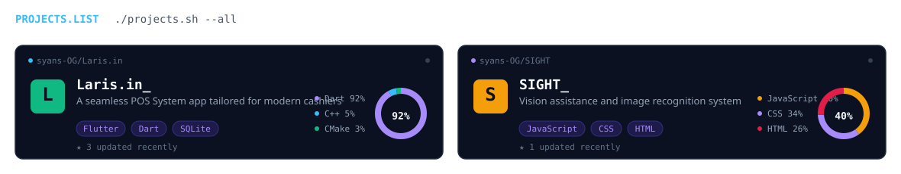

  
  
  
  <picture>
    <source media="(prefers-color-scheme: dark)" srcset="https://streak-stats.demolab.com/?user=syans-OG&amp;hide_border=false&amp;border_color=30363d&amp;background=0d1117&amp;ring=f8fafc&amp;fire=f8fafc&amp;currStreakLabel=8b949e&amp;sideLabels=8b949e&amp;currStreakNum=f8fafc&amp;sideNums=f8fafc&amp;dates=8b949e&amp;titleColor=f8fafc&amp;card_width=1180">
    <source media="(prefers-color-scheme: light)" srcset="https://streak-stats.demolab.com/?user=syans-OG&amp;hide_border=false&amp;border_color=d0d7de&amp;background=ffffff&amp;ring=0f172a&amp;fire=0f172a&amp;currStreakLabel=64748b&amp;sideLabels=64748b&amp;currStreakNum=0f172a&amp;sideNums=0f172a&amp;dates=64748b&amp;titleColor=0f172a&amp;card_width=1180">
    
  </picture>
  <picture>
    <source media="(prefers-color-scheme: dark)" srcset="https://github-readme-stats.vercel.app/api?username=syans-OG&amp;show_icons=true&amp;count_private=true&amp;hide_border=false&amp;title_color=f8fafc&amp;icon_color=f8fafc&amp;text_color=8b949e&amp;bg_color=0d1117&amp;border_color=30363d">
    <source media="(prefers-color-scheme: light)" srcset="https://github-readme-stats.vercel.app/api?username=syans-OG&amp;show_icons=true&amp;count_private=true&amp;hide_border=false&amp;title_color=0f172a&amp;icon_color=0f172a&amp;text_color=64748b&amp;bg_color=ffffff&amp;border_color=d0d7de">
    
  </picture>&nbsp;&nbsp;&nbsp;
  <picture>
    <source media="(prefers-color-scheme: dark)" srcset="https://github-readme-stats.vercel.app/api/top-langs/?username=syans-OG&amp;layout=compact&amp;langs_count=8&amp;hide_border=false&amp;title_color=f8fafc&amp;text_color=8b949e&amp;bg_color=0d1117&amp;border_color=30363d">
    <source media="(prefers-color-scheme: light)" srcset="https://github-readme-stats.vercel.app/api/top-langs/?username=syans-OG&amp;layout=compact&amp;langs_count=8&amp;hide_border=false&amp;title_color=0f172a&amp;text_color=64748b&amp;bg_color=ffffff&amp;border_color=d0d7de">
    
  </picture>
  <picture>
    <source media="(prefers-color-scheme: dark)" srcset="https://raw.githubusercontent.com/syans-OG/syans-OG/output/github-snake-dark.svg">
    <source media="(prefers-color-scheme: light)" srcset="https://raw.githubusercontent.com/syans-OG/syans-OG/output/github-snake.svg">
    
  </picture>

 

  
  
  

